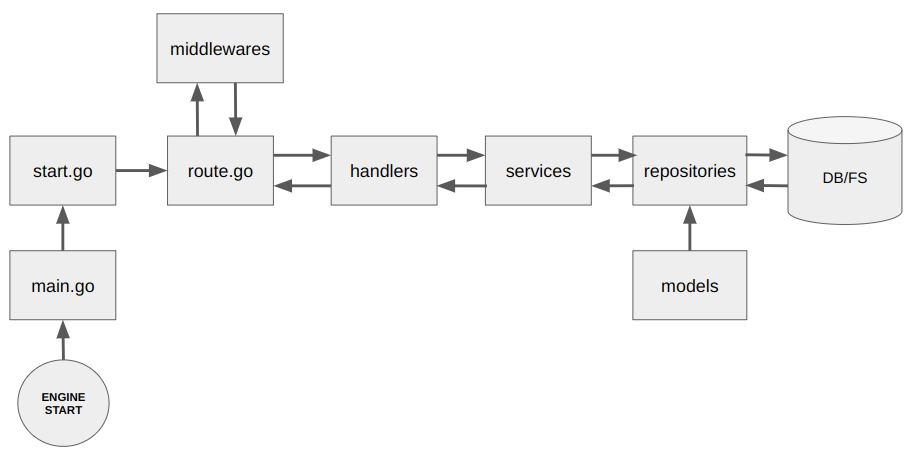

<div id="top"></div>

# BEAN (豆)
A web framework written in GO on-top of `echo` to ease your application development. Our main goal is not to compete with other `Go` framework instead we are mainly focusing on `tooling` and `structuring` a project to make developers life a bit easier and less stressful to maintain their project more in a lean way.

- [BEAN (豆)](#bean-豆)
  - [How to use](#how-to-use)
    - [Initialize a project](#initialize-a-project)
  - [Service-Repository Pattern](#service-repository-pattern)
  - [How To Create Repository File(s)](#how-to-create-repository-files)
  - [One Liner To Create Service And Repositories](#one-liner-to-create-service-and-repositories)
  - [How To Create Handler](#how-to-create-handler)
  - [Two Build Commands](#two-build-commands)
- [Additional Features](#additional-features)
  - [Built-In Logging](#built-in-logging)
  - [Out of the Box Commands](#out-of-the-box-commands)
    - [Generating Secret Key using gen secret command](#generating-secret-key-using-gen-secret-command)
    - [Cryptography using the aes command](#cryptography-using-the-aes-command)
    - [Listing routes using the route list command](#listing-routes-using-the-route-list-command)
  - [Make your own Commands](#make-your-own-commands)
  - [Local K/V Memorystore](#local-kv-memorystore)
  - [Useful Helper Functions](#useful-helper-functions)
  - [Bean Config](#bean-config)
  - [TenantAlterDbHostParam](#tenantalterdbhostparam)
    - [Sample Project](#sample-project)

## How to use
### Initialize a project
1. Install the package by
```
go install github.com/retail-ai-inc/bean/cmd/bean@latest
```
2. Create a project directory
```
mkdir myproject && cd myproject
```
3. Initialize the project using bean by
```
bean init myproject
```
or
```
bean init github.com/me/myproject
```

The above command will produce a nice directory structure with all necessary configuration files and code to start your project quickly. Now, let's build your project and start:

```
make build
./myproject start
```

https://user-images.githubusercontent.com/61860255/155534942-b9ee6b70-ccf3-4cd6-a7c3-bc8bd5089626.mp4


## Service-Repository Pattern
Bean is using service repository pattern for any database, file or external transaction. The `repository` provides a collection of interfaces to access data stored in a database, file system or external service. Data is returned in the form of `structs` or `interface`. The main idea to use `Repository Pattern` is to create a bridge between *models* and *handlers*. Here is a simple pictorial map to understand the service-repository pattern in a simple manner:



## How To Create Repository File(s)

```
bean create repo login
bean create repo logout
```

Above two commands will create 2 repository files under `repositories` folder as `login.go` and `logout.go`.

Now let's associate the above repository files with a service called `auth`:

```
bean create service auth --repo login --repo logout
```

Above command will create a pre-defined sample service file under `services` folder as `auth.go` and automatically set the `type authService struct` and `func NewAuthService`.

Now you can run `make build` or `make build-slim` to compile your newly created service with repositories.

## One Liner To Create Service And Repositories

```
bean create service auth --repo login --repo profile,logout

OR

bean create service auth -r login -r profile,logout
```

Above command will create both service repository files if it doesn't exist and automatically set the association.

## How To Create Handler

```
bean create handler auth
```
Above command will create a pre-defined sample handler file under `handlers` folder as `auth.go`. Furthermore, if you already create an `auth` service with same name as `auth` then bean will automatically associate your handler with the auth service in `route.go`.

## Two Build Commands

Bean supporting 2 build commands:
- `make build` - This is usual go build command.
- `make build-slim` - This will create a slim down version of your binary by turning off the DWARF debugging information and Go symbol table. Furthemore, this will exclude file system paths from the resulting binary using `-trimpath`.

# Additional Features
## Built-In Logging

Bean has a pre-builtin logging system. If you open the `env.json` file from your project directory then you should see some configuration like below:

```
"accessLog": {
  "on": true,
  "bodyDump": true,
  "path": "",
  "bodyDumpMaskParam": []
}
```

- `on` - Turn on/off the logging system. Default is `true`.
- `bodyDump` - Log the request-response body in the log file. This is helpful for debugging purpose. Default `true`
- `path` - Set the log file path. You can set like `logs/console.log`. Empty log path allow bean to log into `stdout`
- `bodyDumpMaskParam` - For security purpose if you don't wanna `bodyDump` some sensetive request parameter then you can add those as a string into the slice like `["password", "secret"]`. Default is empty.

The logger in bean is an instance of log.Logger interface from the github.com/labstack/gommon/log package [compatible with the standard log.Logger interface], there are multiple levels of logging such as `Debug`, `Info`, `Warn`, `Error` and to customize the formatting of the log messages. The logger also supports like `Debugf`, `Infof`, `Warnf`, `Errorf`, `Debugj`, `Infoj`, `Warnj`, `Errorj`.
The logger can be used in any of the layers `handler`, `service`, `repository`.

Example:- 
  ```
  bean.Logger.Debugf("This is a debug message for request %s", c.Request().URL.Path)
  ```

## Out of the Box Commands

A project built with bean also provides the following executable commands alongside the `start` command :-
1.  gen secret 
2.  aes:encrypt/aes:decrypt
3.  route list

### Generating Secret Key using gen secret command

In `env.json` file bean is maintaining a key called `secret`. This is a 32 character long random alphanumeric string. It's a multi purpose hash key or salt which you can use in your project to generate JWT, one way hash password, encrypt some private data or session. By default, `bean` is providing a secret however, you can generate a new one by entering the following command from your terminal:

```
./myproject gen secret
```

### Cryptography using the aes command

This command has two subcommands encrypt and decrypt used for encrypting and decrypting files using the AES encryption algorithm.
AES encryption is a symmetric encryption technique and it requires the use of a password to crypt the data, bean uses the password `secret` in `env.json` as the default password which is created when initializing the project. If you want to use a different password you can use `gen secret` command to update the key. 

For encrypting data
```
./myproject aes:encrypt <string_to_encypt>
```

For decrypting data
```
./myproject aes:decrypt <string_to_decypt>
```

### Listing routes using the route list command

This command enables us to list the routes that the web server is currently serving alongside the correspoding methods and handler functions supporting them.

```
./myproject route list
```

## Make your own Commands

After initializing your project using `bean` you should able to see a directory like `commands/gopher/`. Inside this directory there is a file called `gopher.go`. This file represents the command as below:

```
./myproject gopher
```

Usually you don't need to modify `gopher.go` file. Now, let's create a new command file as `commands/gopher/helloworld.go` and paste the following codes:

```
package gopher

import (
	"errors"
	"fmt"

	"github.com/retail-ai-inc/bean"
	"github.com/spf13/cobra"
)

func init() {
	cmd := &cobra.Command{
		Use:   "helloworld",
		Short: "Hello world!",
		Long:  `This command will just print hello world otherwise hello mars`,
		RunE: func(cmd *cobra.Command, args []string) error {
			NewHellowWorld()
			err := helloWorld("hello")
			if err != nil {
				// If you turn on `sentry` via env.json then the error will be captured by sentry otherwise ignore.
				bean.SentryCaptureException(nil, err)
			}

			return err
		},
	}

	GopherCmd.AddCommand(cmd)
}

func NewHellowWorld() {
	// IMPORTANT: If you pass `false` then database connection will not be initialized.
	_ = initBean(false)
}

func helloWorld(h string) error {
	if h == "hello" {
		fmt.Println("hellow world")
		return nil
	}

	return errors.New("hello mars")
}
```

Now, compile your project and run the command as `./myproject gopher helloworld`. The command will just print the `hellow world`.

## Local K/V Memorystore

`Bean` supports a memory-efficient local K/V store. To configure it, you need to activate it from your `database` parameter in env.json like below:

```
"memory": {
    "on": true,
    "delKeyAPI": {
        "endPoint": "/memory/key/:key",
        "authBearerToken": "<set_any_token_string_of_your_choice>"
    }
}
```

How to use in the code:

```
import "github.com/retail-ai-inc/bean/dbdrivers"

// Initialize the local memory store with key type `string` and value type `any`
m := dbdrivers.MemoryNew()

m.MemorySet("Hello", "World", 0)

data, found := m.MemoryGet("Hello")
if !found {
  // Do something
}

m.MemoryDel("Hello")
```

## Useful Helper Functions

Let's import the package first:

```
import helpers "github.com/retail-ai-inc/bean/helpers"
```

---
**helpers.GetRandomNumberFromRange(min, max int)**
- This function will generate and return a random integer from a minimum and maximum range.

example:
```
id := helpers.GetRandomNumberFromRange(1001, 1050)
```

---
**helpers.(m CopyableMap) DeepCopy()** 
- This function will create a deep copy of a map. The depth of this copy is all inclusive. Both maps and slices will be considered when making the copy. Keep in mind that the slices in the resulting map will be of type []interface{}, so when using them, you will need to use type assertion to retrieve the value in the expected type.

example:
```
amap := map[string]interface{}{
  "a": "bbb",
  "b": map[string]interface{}{
      "c": 123,
  },
  "c": []interface{} {
    "d", "e", map[string]interface{} {
      "f": "g",
    },
  },
}

deepCopyData := helpers.CopyableMap(amap).DeepCopy()
```

---
**helpers.IsFilesExistInDirectory(dir string, filesToCheck []string)** 
- This function will check a file(s) is exist in a specific diretory or not. If you pass multiple files into `filesToCheck` slice then this function will chcek the existence of all those files. If one of the file doesn't exist, it will return `false`. 

example:
```
isExist, err := helpers.IsFilesExistInDirectory("/tmp", []string{"gopher.go", "hello.go"})
if err != nil {
  return err
}
```

---
**helpers.FloatInRange(i, min, max float64)** 
- This function will return the floating point number provided in `i` if the number is between min and max. If `i` is less than `min` then it will return min. If `i` is greater than `max` then it will return max.

example:
```
if helpers.FloatInRange(0.3, 0.0, 1.0) > 0.0 {
  // DO SOMETHING
}
```

---
**helpers.HasStringInSlice(slice []string, str string, modifier func(str string) string)** 
- This function tells whether a slice contains the `str` or not. If a `modifier` func is provided, it is called with the slice item before the comparation.

example:
```
modifier := func(s string) string {
  if s == "cc" {
    return "ee"
  }
  
  return s
}

if !helpers.HasStringInSlice(src, "ee", modifier) {
}
```

---
**helpers.FindStringInSlice(slice []string, str string)** 
- This function will return the smallest index of the `slice` where `str` match a string in the `slice`, otherwise -1 if there is no match.

example:
```
i := helpers.FindStringInSlice([]string{"gopher", "go", "golang"}, "go")
fmt.Println(i) // will print 1
```

---
**helpers.DeleteStringFromSlice(slice []string, index int)** 
- This function delete a string from a specific index of a slice.

example:
```
s := helpers.DeleteStringFromSlice([]string{"gopher", "go", "golang"}, 1)
fmt.Println(s) // will print [gopher golang]
```

---
**helpers.JitterBackoff(min, max time.Duration, attempt int) time.Duration** 
- This function returns capped exponential backoff with jitter. It is useful for http client when you want to retry request. A good explanation about jitter & backoff can be found [here](http://www.awsarchitectureblog.com/2015/03/backoff.html).

example:
```
for i := 0; i <= retryCount; i++ {
    resp, err := http.Get("https://retail-ai.jp")
    if err == nil {
      return nil
    }

    // Don't need to wait when no retries left.
    if i == retryCount {
      return err
    }

    waitTime := helpers.JitterBackoff(time.Duration(100) * time.Millisecond, time.Duration(2000) * time.Millisecond, i)

    select {
    case <-time.After(waitTime):
    case <-c.Done():
      return c.Err()
    }
}
```

---
**helpers.EncodeJWT(claims jwt.Claims, secret string)** 
- This function will Encode JWT `claims` using a secret string and return a signed token as string.

example:
```
type UserJWTTokenData struct {
	ID                   uint64
	UserID               string
	jwt.StandardClaims
}

userClaims := &UserJWTTokenData{
  ID:                   params.Id,
  UserID:               params.UserID,
  StandardClaims: jwt.StandardClaims{
    ExpiresAt: time.Now().Add(1 * time.Hour).Unix(),
  },
}

tokenString, err := helpers.EncodeJWT(userClaims, secret)
if err != nil {
  return err
}
```

---
**helpers.DecodeJWT(c echo.Context, claims jwt.Claims, secret string)** 
- This function will Decode JWT string into `claims` structure using a secret string.

example:
```
type UserJWTTokenData struct {
	ID                   uint64
	UserID               string
	jwt.StandardClaims
}

var userClaims UserJWTTokenData

err := helpers.DecodeJWT(c, &userClaims, secret)
if err != nil {
  return err
}
```

---
**helpers.DecodeJWT(c echo.Context, claims jwt.Claims, secret string)** 
- This function will Extract JWT from `Authorization` HTTP header and returns the token as string.

example:
```
jwtString := helpers.ExtractJWTFromHeader(c)
```

---
**helpers.ConvertInterfaceToSlice(value interface{})** 
- ConvertInterfaceToSlice will convert an interface `value` into slice. The `value` is also supporting pointer interface.

example:
```
slice := helpers.ConvertInterfaceToSlice(1)
fmt.Println(slice) // will print [1]

slice := helpers.ConvertInterfaceToSlice([]int{1, 2, 3})
fmt.Println(slice) // will print [1 2 3]
```

---
**helpers.ConvertInterfaceToBool(value interface{})** 
- ConvertInterfaceToBool will convert an interface `value` into boolean. The `value` is also supporting pointer interface.

example:
```
boolean, err := helpers.ConvertInterfaceToBool(true)
fmt.Println(boolean) // will print true

boolean, err := helpers.ConvertInterfaceToBool([]int{1, 2, 3})
fmt.Println(boolean) // will print false

boolean, err := helpers.ConvertInterfaceToBool("")
fmt.Println(boolean) // will print false
```

---
**helpers.ConvertInterfaceToFloat(value interface{})** 
- ConvertInterfaceToFloat will convert an interface `value` into float. The `value` is also supporting pointer interface.

example:
```
float, err := helpers.ConvertInterfaceToFloat("1")
fmt.Println(float) // will print 1

float, err := helpers.ConvertInterfaceToFloat("2.234")
fmt.Println(float) // will print 2.234

float, err := helpers.ConvertInterfaceToFloat(0.1)
fmt.Println(float) // will print 0.1
```

---
**helpers.ConvertInterfaceToString(value interface{})** 
- ConvertInterfaceToString will convert an interface `value` into string. The `value` is also supporting pointer interface.

example:
```
string, err := helpers.ConvertInterfaceToString("abc")
fmt.Println(string) // will print abc

string, err := helpers.ConvertInterfaceToString(true)
fmt.Println(string) // will print true

string, err := helpers.ConvertInterfaceToString(0.1)
fmt.Println(string) // will print 0.1
```

---
**helpers.SingleDoChan[T any](ctx context.Context, key string, call func()(T,error), retry int, ttl ...time.Duration)** 
- SingleDoChan provides a duplicate function call suppression mechanism using singleflight.Group. It ensures that only one execution is in-flight for a given key at a time and returns the results of the given function. Duplicate calls wait for the first call to complete and receive the same results. Additionally, SingleDoChan implements retry logic in case the callback function returns an error, and an optional ttl parameter. This helper is useful for handling concurrent requests that need to access a shared resource, which would cause problems such as race conditons, deadlocks, cache penetration etc.
- Make sure the uniqueness of the `key` in different situations. 
- `retry` refers to the number of times the `call` function will be repeated if it fails.
- `ttl` represents the expiration time of the `key`.

example:
```
data, err := helpers.SingleDoChan(c, "key", func() (string, error) {
    return "data",nil
}, 2, time.Second)
```

## Bean Config 

Bean provides the `BeanConfig` struct to enable the user to tweak the configuration of their consumer project as per their requirement .
Bean configs default values are picked from the `env.json` file, but can be updated during runtime as well.
	https://pkg.go.dev/github.com/retail-ai-inc/bean#Config

<details>
  <summary>BeanConfig</summary>
	
  Some of the configurable parameters are :-

	Environment: represents the environment in which the project is running (e.g. development, production, etc.)

	DebugLogPath: represents the path of the debug log file.

	Secret: represents a secret string key used for encryption and decryption in the project.
	Example Usecase:- while encoding/decoding JWTs.

	HTTP: represents a custom wrapper to deal with HTTP/HTTPS requests. 
	The wrapper provides by default some common features but also some exclusive features like:-
		BodyLimit: Sets the maximum allowed size for a request body, return `413 - Request Entity Too Large` if the size exceeds the limit.

		IsHttpsRedirect: A boolean that represents whether to redirect HTTP requests to HTTPS or not.
	
		KeepAlive: A boolean that represents whether to keep the HTTP connection alive or not.

		AllowedMethod: A slice of strings that represents the allowed HTTP methods.
		Example:- ["DELETE","GET","POST","PUT"]

	SSL: used when web server uses HTTPS for communication.
	The SSL struct contains the following parameters:-
		On: A boolean that represents whether SSL is enabled or not.

		CertFile: represents the path of the certificate file.

		PrivFile: represents the path of the private key file.

		MinTLSVersion: represents the minimum TLS version required.
	
</details>

## TenantAlterDbHostParam

The `TenantAlterDbHostParam` is helpful in multitenant scenarios when we need to run some 
cloudfunction or cron and you cannot connect your memorystore/SQL/mongo server from 
cloudfunction/VM using the usual `host` ip.

  ```
  bean.TenantAlterDbHostParam = "gcpHost"
  ```

### Sample Project

A CRUD project that you can refer to understand how bean works with service repository pattern.
https://github.com/RohitChaurasia97/movie_tracker
