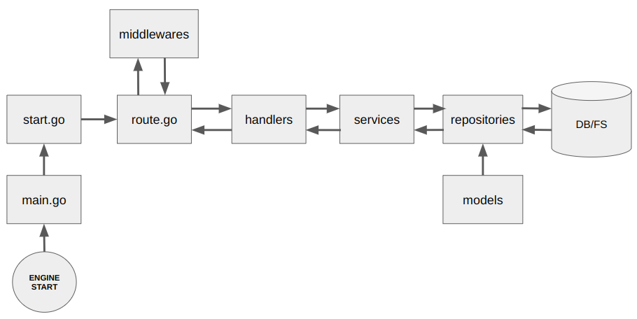

<div id="top"></div>

# BEAN (豆)

A web framework written in GO on-top of `echo` to ease your application development. Our main goal is not to compete with other `Go` framework instead we are mainly focusing on `tooling` and `structuring` a project to make developers life a bit easier and less stressful to maintain their project more in a lean way.

- [BEAN (豆)](#bean-豆)
  - [How to use](#how-to-use)
    - [Initialize a project](#initialize-a-project)
  - [Service-Repository Pattern](#service-repository-pattern)
  - [How To Create Repository File(s)](#how-to-create-repository-files)
  - [One Liner To Create Service And Repositories](#one-liner-to-create-service-and-repositories)
  - [How To Create Handler](#how-to-create-handler)
  - [Two Build Commands](#two-build-commands)
- [Additional Features](#additional-features)
  - [Built-In Logging](#built-in-logging)
  - [Built-In testing](#built-in-testing)
  - [Out of the Box Commands](#out-of-the-box-commands)
    - [Generating Secret Key using gen secret command](#generating-secret-key-using-gen-secret-command)
    - [Cryptography using the aes command](#cryptography-using-the-aes-command)
    - [Listing routes using the route list command](#listing-routes-using-the-route-list-command)
  - [Make your own Commands](#make-your-own-commands)
  - [Local K/V Memorystore](#local-kv-memorystore)
  - [Useful Helper Functions](#useful-helper-functions)
  - [Bean Config](#bean-config)
  - [TenantAlterDbHostParam](#tenantalterdbhostparam)
    - [Sample Project](#sample-project)
  - [Logging Module](#logging-module)
    - [Architecture](#architecture)
    - [Components](#components)
      - [Logger](#logger)
      - [Extractors](#extractors)
      - [Pipeline](#pipeline)
      - [Processors](#processors)
      - [Sink](#sink)
    - [Concurrency Safety](#concurrency-safety)
    - [Graceful Shutdown](#graceful-shutdown)
    - [Example](#example)
    - [File Reference](#file-reference)
    - [Performance](#performance)
    - [Design Principles](#design-principles)
  - [HTTP Logging Transport](#http-logging-transport)
    - [Features](#features-1)
    - [Example](#example)
    - [Notes](#notes)

## How to use

### Initialize a project

1. Install the package by

```sh
go install github.com/retail-ai-inc/bean/v2/cmd/bean@latest
```

2. Create a project directory

```sh
mkdir myproject && cd myproject
```

3. Initialize the project using bean by

```sh
bean init myproject
```

or

```sh
bean init github.com/me/myproject
```

The above command will produce a nice directory structure with all necessary configuration files and code to start your project quickly. Now, let's build your project and start:

```sh
make build
./myproject start
```

<https://user-images.githubusercontent.com/61860255/155534942-b9ee6b70-ccf3-4cd6-a7c3-bc8bd5089626.mp4>

## Service-Repository Pattern

Bean is using service repository pattern for any database, file or external transaction. The `repository` provides a collection of interfaces to access data stored in a database, file system or external service. Data is returned in the form of `structs` or `interface`. The main idea to use `Repository Pattern` is to create a bridge between _models_ and _handlers_. Here is a simple pictorial map to understand the service-repository pattern in a simple manner:



## How To Create Repository File(s)

```sh
bean create repo login
bean create repo logout
```

Above two commands will create 2 repository files under `repositories` folder as `login.go` and `logout.go`.

Now let's associate the above repository files with a service called `auth`:

```sh
bean create service auth --repo login --repo logout
```

Above command will create a pre-defined sample service file under `services` folder as `auth.go` and automatically set the `type authService struct` and `func NewAuthService`.

Now you can run `make build` or `make build-slim` to compile your newly created service with repositories.

## One Liner To Create Service And Repositories

```sh
bean create service auth --repo login --repo profile,logout

OR

bean create service auth -r login -r profile,logout
```

Above command will create both service repository files if it doesn't exist and automatically set the association.

## How To Create Handler

```sh
bean create handler auth
```

Above command will create a pre-defined sample handler file under `handlers` folder as `auth.go`. Furthermore, if you already create an `auth` service with same name as `auth` then bean will automatically associate your handler with the auth service in `route.go`.

## Two Build Commands

Bean supporting 2 build commands:

- `make build` - This is usual go build command.
- `make build-slim` - This will create a slim down version of your binary by turning off the DWARF debugging information and Go symbol table. Furthemore, this will exclude file system paths from the resulting binary using `-trimpath`.

# Additional Features

## Built-In Logging

Bean has a pre-builtin logging system. If you open the `env.json` file from your project directory then you should see some configuration like below:

```json
"accessLog": {
  "on": true,
  "bodyDump": true,
  "path": "",
  "runtimePlatform": "gcp",
  "bodyDumpMaskParam": ["password", "token"],
  "async": false,
  "asyncQueueSize": 4096
}
```

- `on` — Turn the access logging middleware on or off. Default is `true`.
- `bodyDump` — When `true`, the access logger middleware captures the **HTTP request body** and **response body** and writes them to structured logs **after the handler runs** (along with latency and status). The access logger emits an initial `ACCESS` line before the handler and, if `bodyDump` is enabled, a second `DUMP` line with `request_body` / `response_body` fields. This is useful for debugging but increases log volume and I/O; set to `false` in production if you do not need full bodies. Default is `true`.
- `path` — Log file path for the Bean structured logger output (e.g. `tmp/logs/console.log`). An **empty** string means logs go to **stdout** (Echo logger output). When a path is set, the file is opened by the logger and will be properly closed during graceful shutdown.
- `runtimePlatform` — Deployment / log **runtime** hint for structured logs (string, optional). Common values: `gcp` (Google Cloud), `aws` (Amazon Web Services), `azure` (Microsoft Azure), or leave **empty** for a generic default. It is written on every structured trace log line as `runtime_platform`, and selects which JSON key holds the trace id from Sentry context: `gcp` → `logging.googleapis.com/trace`; `aws` / `azure` → `trace_id`; empty or unknown → `trace`. It does **not** replace cloud SDK configuration elsewhere.
- `bodyDumpMaskParam` — List of **JSON object keys** whose values should be **masked** in structured log fields before write. These names are passed to `log.Init` → `WithMaskFields` and applied by `MaskProcessor`: matching keys at **any nesting level** in maps / decoded JSON have their values replaced with `****`. Use the same key names as in your API JSON bodies (e.g. `password`, `access_token`). Nested objects are traversed; only **exact key names** are matched (not dot-paths like `user.password`). Default is an empty slice.
- `async` — When `true`, log writes are performed asynchronously by a background worker goroutine. The caller's `Write` only enqueues the encoded buffer, reducing latency on the request path. Default is `false` (synchronous).
- `asyncQueueSize` — Bounded channel capacity for async mode. When the queue is full, new log entries are dropped (drop-new policy) rather than blocking the request. Default is `4096`. Ignored when `async` is `false`.

**Note:** `bodyDumpMaskParam` affects **structured** `TraceInfo` / `TraceError` payloads (including `request_body` / `response_body` when they contain JSON). It does not change what the middleware reads from the wire; it only redacts values in the logged output.

**Scope of `bodyDumpMaskParam` (where masking applies)**  
`accessLog.bodyDumpMaskParam` in `env.json` is wired as `log.Init(..., WithMaskFields(config.Bean.AccessLog.BodyDumpMaskParam))`. That installs **MaskProcessor** on the **Bean structured logger** singleton, so the same key list applies to **all** entries produced via that logger’s `TraceInfo` / `TraceError`—not only inbound access logs:

| Area          | Location                                                                                | Typical log content                                                                                                                            |
| ------------- | --------------------------------------------------------------------------------------- | ---------------------------------------------------------------------------------------------------------------------------------------------- |
| Inbound HTTP  | `packages/bean/internal/middleware` (`AccessLoggerWithConfig`)                          | `ACCESS` / `DUMP`: `request_body`, `response_body`, headers map, etc.                                                                          |
| Outbound HTTP | `packages/bean/transport/http` (`LoggingTransport`)                                     | `OUTBOUND_API`: `request_body`, `response_body` (when the transport’s body dump option is on), `request_header` / `response_header` maps, etc. |
| Elsewhere     | Any code calling `log.Logger()` (or the same `AccessLogger`) `TraceInfo` / `TraceError` | Same recursive masking on the `fields` map for that entry.                                                                                     |

The logger in bean is an instance of log.Logger interface from the `github.com/labstack/gommon/log` package [compatible with the standard log.Logger interface], there are multiple levels of logging such as `Debug`, `Info`, `Warn`, `Error` and to customize the formatting of the log messages. The logger also supports like `Debugf`, `Infof`, `Warnf`, `Errorf`, `Debugj`, `Infoj`, `Warnj`, `Errorj`.
The logger can be used in any of the layers `handler`, `service`, `repository`.

Example:-

```sh
log.Logger().Debugf("This is a debug message for request %s", c.Request().URL.Path)
```

## Built-In testing

Bean provides a built-in testing framework to test your project. To run the test, you need to run the following command from your project directory like below:

```sh
bean test ./... -output=html -output-file=./your/proejct/report
```

If you want to know more about the testing command then you can run `bean test --help` from your project directory.

With helper functions under`test` package, you can easily test your project. The `test` package provides the following helper functions:-

- `SetupConfig` - This function will setup the config for your test. You can pass the `env.json` file path as a parameter. It will read config under `test` tag from the `env.json` file and set the config `TestConfig` for your test so that you can use the config in your test easily.

- `SetSeverity` - This function will set different severity levels for different tests so that you can make a result report of your testing more organized; you can see aggregated results of your tests based on the severity level either in JSON or HTML format.

- other util functions - These contains some helper functions like `SkipTestIfInSkipList`(that is supposed to be used along with `TestConfig`) to make your testing easier.

## Out of the Box Commands

A project built with bean also provides the following executable commands alongside the `start` command :-

1. gen secret
2. aes:encrypt/aes:decrypt
3. route list

### Generating Secret Key using gen secret command

In `env.json` file bean is maintaining a key called `secret`. This is a 32 character long random alphanumeric string. It's a multi purpose hash key or salt which you can use in your project to generate JWT, one way hash password, encrypt some private data or session. By default, `bean` is providing a secret however, you can generate a new one by entering the following command from your terminal:

```sh
./myproject gen secret
```

### Cryptography using the aes command

This command has two subcommands encrypt and decrypt used for encrypting and decrypting files using the AES encryption algorithm.
AES encryption is a symmetric encryption technique and it requires the use of a password to crypt the data, bean uses the password `secret` in `env.json` as the default password which is created when initializing the project. If you want to use a different password you can use `gen secret` command to update the key.

For encrypting data

```sh
./myproject aes:encrypt <string_to_encypt>
```

For decrypting data

```sh
./myproject aes:decrypt <string_to_decypt>
```

### Listing routes using the route list command

This command enables us to list the routes that the web server is currently serving alongside the correspoding methods and handler functions supporting them.

```sh
./myproject route list
```

## Make your own Commands

After initializing your project using `bean` you should able to see a directory like `commands/gopher/`. Inside this directory there is a file called `gopher.go`. This file represents the command as below:

```sh
./myproject gopher
```

Usually you don't need to modify `gopher.go` file. Now, let's create a new command file as `commands/gopher/helloworld.go` and paste the following codes:

```go
package gopher

import (
 "errors"
 "fmt"

 "github.com/retail-ai-inc/bean/v2"
 "github.com/retail-ai-inc/bean/v2/trace"
 "github.com/spf13/cobra"
)

func init() {
 cmd := &cobra.Command{
  Use:   "helloworld",
  Short: "Hello world!",
  Long:  `This command will just print hello world otherwise hello mars`,
  RunE: func(cmd *cobra.Command, args []string) error {
   NewHellowWorld()
   err := helloWorld("hello")
   if err != nil {
    // If you turn on `sentry` via env.json then the error will be captured by sentry otherwise ignore.
    trace.SentryCaptureException(cmd.Context(), err)
   }

   return err
  },
 }

 GopherCmd.AddCommand(cmd)
}

func NewHellowWorld() {
 // IMPORTANT: If you pass `false` then database connection will not be initialized.
 _ = initBean(false)
}

func helloWorld(h string) error {
 if h == "hello" {
  fmt.Println("hellow world")
  return nil
 }

 return errors.New("hello mars")
}
```

Now, compile your project and run the command as `./myproject gopher helloworld`. The command will just print the `hellow world`.

## Local K/V Memorystore

`Bean` supports a memory-efficient local K/V store. To configure it, you need to activate it from your `database` parameter in env.json like below:

```json
"memory": {
    "on": true,
    "delKeyAPI": {
        "endPoint": "/memory/key/:key",
        "authBearerToken": "<set_any_token_string_of_your_choice>"
    }
}
```

How to use in the code:

```go
import "github.com/retail-ai-inc/bean/v2/store/memory"

// Initialize the local memory store with key type `string` and value type `any`
m := memory.NewMemory()

// The third parameter is the `ttl`. O means forever.
m.SetMemory("Hello", "World", 0)

data, found := m.GetMemory("Hello")
if !found {
  // Do something
}

m.DelMemory("Hello")
```

The `delKeyAPI` parameter will help you proactively delete your local cache if you cache something from your database like SQL or NOSQL. For example, suppose you cache some access token in your local memory, which resides in your database, to avoid too many connections with your database. In that case, if your access token gets changed from the database, you can trigger the `delKeyAPI` endpoint with the key and `Bearer <authBearerToken>` as the header parameter then `bean` will delete the key from the local cache. Here, you must be careful if you run the `bean` application in a `k8s` container because then you have to trigger the `delKeyAPI` for all your pods separately by IP address from `k8s`.

## Useful Helper Functions

Please refer to the [`helpers` package](helpers/) in this codebase or [go doc](https://pkg.go.dev/github.com/retail-ai-inc/bean/v2/helpers) for more information.

## Bean Config

Bean provides the [`config.Config`](https://pkg.go.dev/github.com/retail-ai-inc/bean/v2/config#Config) struct to enable the user to tweak the configuration of their consumer project as per their requirement .
Bean configs default values are picked from the `env.json` file, but can be updated during runtime as well.
<https://pkg.go.dev/github.com/retail-ai-inc/bean#Config>

<details>
  <summary>config.Config</summary>

Some of the configurable parameters are:

- `Environment`: represents the environment in which the project is running (e.g. development, production, etc.)

- `DebugLogPath`: represents the path of the debug log file.

- `Secret`: represents a secret string key used for encryption and decryption in the project.
  Example Usecase:- while encoding/decoding JWTs.

- `HTTP`: represents a custom wrapper to deal with HTTP/HTTPS requests.
  The wrapper provides by default some common features but also some exclusive features like:-
  - `BodyLimit`: Sets the maximum allowed size for a request body, return `413 - Request Entity Too Large` if the size exceeds the limit.

  - `IsHttpsRedirect`: A boolean that represents whether to redirect HTTP requests to HTTPS or not.

  - `KeepAlive`: A boolean that represents whether to keep the HTTP connection alive or not.

  - `AllowedMethod`: A slice of strings that represents the allowed HTTP methods.
    Example:- `["DELETE","GET","POST","PUT"]`

  - `SSL`: used when web server uses HTTPS for communication.
    The SSL struct contains the following parameters:-
    - `On`: A boolean that represents whether SSL is enabled or not.

    - `CertFile`: represents the path of the certificate file.

    - `PrivFile`: represents the path of the private key file.

    - `MinTLSVersion`: represents the minimum TLS version required.

- `Prometheus`: represents the configuration for the Prometheus metrics.
  The Prometheus struct contains the following parameters:-
  - `On`: A boolean that represents whether Prometheus is enabled or not.

  - `SkipEndpoints`: represents the endpoints/paths to skip from Prometheus metrics.

  - `Subsystem`: represents the subsystem name for the Prometheus metrics. The default value is `echo` if empty.

</details>

## Logging Module

The `log` package (`github.com/retail-ai-inc/bean/v2/log`) provides a structured, pipeline-based access logging system with sync/async writing, field masking, escape cleanup, and distributed trace correlation.

### Architecture

```text
TraceInfo / TraceError
        |
        v
    +--------+
    | Entry  |  timestamp / severity / level / fields / trace
    +---+----+
        |
        v
  +----------+     +------------------+     +-----------------------+
  | Pipeline |---->| MaskProcessor    |---->| RemoveEscapeProcessor |
  +----+-----+     +------------------+     +-----------------------+
       |
       v
   +------+   sync:  io.Writer.Write on caller goroutine
   | Sink |--
   +------+   async: chan *bytes.Buffer -> background worker -> io.Writer.Write
```

### Components

#### Logger

Application entry point. The public interface is `BeanLogger`, which extends `echo.Logger` and adds:

- `TraceInfo(ctx context.Context, level string, fields map[string]any)` — structured info-level log with trace context
- `TraceError(ctx context.Context, level string, fields map[string]any)` — structured error-level log with trace context

The logger builds an `Entry` (timestamp, severity, level, fields, trace), runs it through the pipeline, then writes to the sink.

Functional options for `NewLogger`:

| Option | Description |
|---|---|
| `WithAccessLogPath(path)` | Log file path; empty = echo logger output |
| `WithMaskFields(fields)` | Field names to mask with `****` |
| `WithRuntimePlatform(platform)` | Cloud platform hint (`gcp`/`aws`/`azure`) for trace key |
| `WithSinkAsync(async, queueSize)` | Enable async writing with bounded queue |

#### Extractors

Extract contextual metadata from `context.Context` into `Entry.Trace`. Implement `TraceExtractor`:

- `Extract(ctx context.Context) Trace`

The package provides `NewSentryExtractor()` to fill `TraceID` and `SpanID` from Sentry's span context. Extractors run when each log entry is created, before the pipeline.

#### Pipeline

`Pipeline` runs a list of processors in order, then writes the result to a `Sink`. Created with `NewPipeline(sink Sink, processors ...Processor)`.

#### Processors

Transform log entries before output. Implement `Processor` (`Process(entry Entry) Entry`). Built-in:

- **MaskProcessor** — `NewMaskProcessor(fields []string)` masks sensitive field values (e.g. `"password"`).
- **RemoveEscapeProcessor** — `NewRemoveEscapeProcessor()` parses and unescapes JSON strings in fields so nested structures are logged as objects rather than escaped strings.

Processors are composable and applied in pipeline order.

#### Sink

Final output destination. Implement the `Sink` interface (`Write(entry Entry) error`). The package provides `NewSink(writer io.Writer, projectID string)` which writes JSON lines (GCP-compatible: timestamp, severity, level, fields, optional `logging.googleapis.com/trace`).

### Features

- Structured (map-based) logging
- Context-aware trace extraction (e.g. Sentry)
- Processor pipeline (mask, remove escape)
- Pluggable sink (e.g. stdout, any `io.Writer`)
- JSON-first design
- Cloud-ready (GCP trace format)

### Example

Initialize once with Echo logger, then call `TraceInfo` / `TraceError`:

```go
import (
    "github.com/labstack/echo/v4"
    "github.com/retail-ai-inc/bean/v2/log"
)

// At startup
e := echo.New()
blogger := log.Init(e.Logger)

// In handlers or services
blogger.TraceInfo(ctx, "outbound_http", map[string]any{
    "method": "GET",
    "url":    "https://example.com",
})
blogger.TraceError(ctx, "payment_failed", map[string]any{"error": err.Error()})
```

Custom logger with functional options:

```go
blogger, err := log.NewLogger(
    e.Logger,
    log.WithRuntimePlatform("gcp"),
    log.WithMaskFields([]string{"password", "token"}),
    log.WithSinkAsync(true, 4096),
)
```

Internally, `NewLogger` builds: Sentry extractor → Pipeline(MaskProcessor, RemoveEscapeProcessor) → Sink(echo.Logger.Output(), projectID).

**Sync vs Async (parallel):** Async is ~27% faster (1369 vs 1886 ns/op) because IO is offloaded to a single worker goroutine.

**RWMutex overhead:** Negligible — benchmarks show no measurable difference compared to lock-free code, while providing full safety against send-on-closed-channel panics.

### Design Principles

- Separation of concerns (extraction → transformation → output)
- Composable processor pipeline
- Minimal framework coupling (Echo logger + optional Sentry)
- Extensible via custom processors and sinks
- Zero-copy async path with `sync.Pool` buffer reuse

## HTTP Logging Transport

The `transport/http` package provides a custom `http.RoundTripper` that logs outbound HTTP requests using the structured logger (`log.AccessLogger`).

It captures:

- HTTP method and URL
- Response status and latency (ms)
- Optional request/response body (when `DumpBody` is true)
- Error message on failure
- Request headers: always includes `X-Request-ID` from context when present; optional extra headers via `AllowedReqHeaders`
- Optional response headers via `AllowedRespHeaders`

### LoggingOptions

| Field                | Description                                                                      |
| -------------------- | -------------------------------------------------------------------------------- |
| `DumpBody`           | Include request and response bodies in log fields.                               |
| `MaxBodySize`        | Max bytes to read from response body (default 64KB).                             |
| `LogType`            | Written as `"type"` in log fields for filtering (e.g. in GCP).                   |
| `AllowedReqHeaders`  | Request header names to log. Empty uses `config.Bean.AccessLog.ReqHeaderParam`.  |
| `AllowedRespHeaders` | Response header names to log. Empty uses `config.Bean.AccessLog.ResHeaderParam`. |

### Features

- Wraps any `http.RoundTripper` (nil uses `http.DefaultTransport`).
- Logs via `AccessLogger.TraceInfo` (success) or `TraceError` (failure) with level `"OUTBOUND_API"`.
- Optional body dumping via `LoggingOptions.DumpBody`; `MaxBodySize` caps response body size (default 64KB).
- Safe body re-read with `io.NopCloser` so the request can still be sent.
- Compatible with the log pipeline (masking, sink). Body fields are `[]byte`; in JSON output they appear as base64 unless the pipeline or sink converts them.

### Example

```go
import (
    "github.com/retail-ai-inc/bean/v2/log"
    "github.com/retail-ai-inc/bean/v2/transport/http"
)

// logger is a log.AccessLogger (e.g. from log.Init(e.Logger) or log.Logger())
transport := http.NewLoggingTransport(
    nil, // base RoundTripper; nil = http.DefaultTransport
    logger,
    http.LoggingOptions{
        DumpBody:           true,
        MaxBodySize:        64 * 1024,
        LogType:            "my-service",
        AllowedReqHeaders:  []string{"Authorization", "Content-Type"},
        AllowedRespHeaders: []string{"Content-Type"},
    },
)

client := resty.New()
client.SetTransport(transport)
```

### Notes

- When `DumpBody` is enabled, request and response bodies are stored as `[]byte`; `encoding/json` encodes them as base64 in the final log line.
- Body dumping increases memory use; use cautiously in production.
- Leave `AllowedReqHeaders` or `AllowedRespHeaders` empty to use the access-log config from `env.json` (`ReqHeaderParam` / `ResHeaderParam`).

## TenantAlterDbHostParam

The `TenantAlterDbHostParam` is helful in multitenant scenarios when we need to run some
cloudfunction or cron and you cannot connect your memorystore/SQL/mongo server from
cloudfunction/VM using the usual `host` ip.

```sh
bean.TenantAlterDbHostParam = "gcpHost"
```

### Sample Project

A CRUD project that you can refer to understand how bean works with service repository pattern.
<https://github.com/RohitChaurasia97/movie_tracker>
